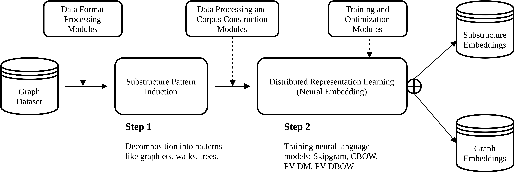

Introduction with example
=========================

Geo2DR is a python library conceived to quickly construct systems capable of learning distributed representations of graphs. To do so, the library contains various graph decomposition algorithms and neural language models that serve as the main components in a two step design methodology for learning distributed representations. Also included are data preprocessing tools for common benchmark datasets and efficient corpus data/dataloader implementations for interfacing with the included neural language models written with PyTorch. Thereby the library provides a unified set of tools for quickly constructing systems capabale of learning distributed representations of graphs and its substructures. Considerable care was taken to shape outputs that are compatible with other libraries such as Gensim, custom PyTorch and Tensorflow implementations useful for learning distributed representations and network analysis tools such as Gephi and NetworkX.

In this page we will cover some of the common design principles underpinning popular systems for learning distributed representations of graphs. Then we proceed to give a practical example of obtaining data and building Narayanan et al's Graph2Vec system for learning graph level embeddings.  

Basic theory and methodology
----------------------------

Popular sytems such as Deep Graph Kernels (Yanardag and Vishwanathan, 2015), Graph2Vec (Narayanan et al., 2017), and Anonymous Walk Embeddings (AWE) (Ivanov and Burnaev, 2018) are all methods which learn distributed representations of arbitrary sized graphs. Such systems can be characterised by a common pipeline described below (and in the figure above).

1. **Decomposition of graphs into descriptive substructures:** Each graph in the dataset of graphs is reduced to a set of induced substructure patterns according to some decomposition algorithm. An example is finding all the rooted subgraphs of a graph using the Weisfeiler-Lehman algorithm (Shervashidze et al., 2011) as done in Graph2Vec, or shortest paths as in Deep Graph Kernels to name a few. The union of the sets of substructure patterns induced in each graph across the dataset defines a common "vocabulary" that can describe a graph in relation to another graph based on the induced subgraphs patterns. 
2. **Learning distributed vector representations:** The distributive hypothesis (Harris, 1954) posits that words which are used and exist within the same context have similar semantic meanings. In a similar way we may define that a graph is *contextualized* by the substructure patterns producing a new dataset of (graph, induced_subgraph_pattern) pairs. Embedding methods which exploit the distributive hypothesis such as skipgram (Mikolov et al., 2014) can then be used to learn fixed-size distributed vector embeddings of each substructure pattern or graph in an unsupervised manner.

Once the distributed vector representations are learned for each of the graphs in a dataset. The graph embeddings may be used in any downstream application such as graph classification, regression, etc.

A full example
--------------

To start we need to download a dataset. We will use the well known benchmark dataset MUTAG downloaded from the TU Dortmund Graph Kernel Benchmark `website <https://ls11-www.cs.tu-dortmund.de/staff/morris/graphkerneldatasets>`_. Let us save the unpacked archive into a folder called ``original_data/`` so the dataset as downloaded will be a directory ``original_data/MUTAG``. 

Geo2DR assumes graphs to be saved in the GEXF (Graph Exchange XML Format) because it is compatible with network analysis software such as Gephi and NetworkX, and its useful to be able to study a single graph/single file in isolation. We will transform the dataset of graphs into a corresponding dataset inside another directory with the following code.

.. code-block:: python

	from geometric2dr.data import DortmundGexf

	gexifier = DortmundGexf("MUTAG", "original_data/", "data/")
	gexifier.format_dataset()

This will result in the following dataset format.

* ``data/MUTAG/`` : folder containing individual gexf files of each graph. A graph will be denoted by the graph IDs used in the original data. In this case graph 0 would be ``data/MUTAG/0.gexf``
* ``data/MUTAG.Labels`` : a plain-text file with each line containing a graph's file_name and its classification

Given the formatted data we can now induce substructure patterns across the graphs files (in this case all of those in the MUTAG folder). Here we will induce rooted subgraphs up to depth 3 using the Weisfeiler-Lehman node relabeling algorithm outlined in Shervashidze et al. 

.. code-block:: python

	from geometric2dr.decomposition.weisfeiler_lehman_patterns import wl_corpus
	import geometric2dr.embedding_methods.utils as utils

	dataset_path = "data/MUTAG"
	wl_depth = 3

	graph_files = utils.get_files(dataset_path, ".gexf")
	wl_corpus(graph_files, wl_depth)

The ``wl_corpus()`` function induces rooted subgraph patterns across list of gexf files in ``graph_files``, and for each graph builds a document which describes the induced patterns within it (more on this can be found in the data formatting tutorial). These have a special extension specific to each decomposition algorithm or set by the user; in this case the extension will be ``.wld3`` for Weisfeiler-lehman decomposition to depth 3. Having permanent files being generated as a side effect of the graph decomposition process is useful for later study and also if we want to use the same induced patterns in the upcoming step of learning distributed representations of the graphs.

To learn distributed representations we need to construct a new target-context dataset. In Graph2Vec a graph is contextualised by the substructure patterns within it, and uses the PV-DBOW architecture with negative sampling to directly learn graph-level embeddings. Hence we use the ``PVDBOWInMemoryCorpus`` which is a extension of a PyTorch dataset. This can interface with a standard PyTorch dataloader to load the data into a ``skipgram`` model that we train in a simple loop using a simple and recognizable PyTorch.nn workflow.

.. code-block:: python
	
	import torch
	import torch.optim as optim
	from torch.utils.data import DataLoader
	from geometric2dr.embedding_methods.pvdbow_data_reader import PVDBOWInMemoryCorpus
	from geometric2dr.embedding_methods.skipgram import Skipgram

	# Instantiate corpus dataset, dataloader and skipgram architecture
	corpus = PVDBOWCorpus(dataset_path, ".wld3") # generates the target-context dataset
	dataloader = DataLoader(corpus, batch_size=1000, shuffle=False, collate_fn = corpus.collate)
	skipgram = Skipgram(num_targets=corpus.num_graphs, vocab_size=corpus.num_subgraphs, emb_dimension=32)

	# Set torch device, optimizers and make a training loop
	if torch.cuda.is_available():
		device = torch.device("cuda")
		skipgram.cuda()
	else:
		device = torch.device("cpu")

	optimizer = optim.SGD(skipgram.parameters(), lr=0.1)
	for epoch in range(100):
		print("### Epoch: " + str(epoch))
		running_loss = 0.0
		for i, sample_batched in enumerate(dataloader):

			if len(sample_batched[0]) > 1:
				pos_target = sample_batched[0].to(device)
				pos_context = sample_batched[1].to(device)
				neg_context = sample_batched[2].to(device)

				optimizer.zero_grad()
				loss = skipgram.forward(pos_target, pos_context, neg_context) # the loss is integrated into the forward function
				loss.backward()
				optimizer.step()

				running_loss = running_loss * 0.9 + loss.item() * 0.1
		print(" Loss: " + str(running_loss))

	final_graph_embeddings = skipgram.target_embeddings.weight.cpu().data.numpy()

And we have our graph embeddings! As this is such a common set up, Geo2DR also comes with a number of ``Trainer`` classes which build corpus datasets, loaders, train neural language models, and save their outputs. All of the above code can be replaced with this short trainer.

.. code-block:: python
	
	from geometric2dr.embedding_methods.pvdbow_trainer import InMemoryTrainer

	# Instantiate a PV-DBOW trainer to learn distributed reps directly.
	trainer = InMemoryTrainer(corpus_dir=dataset_path, extension=".wld3", output_fh="graph_embeddings.json",
	                  emb_dimension=32, batch_size=1000, epochs=100, initial_lr=0.1,
	                  min_count=0)
	trainer.train()
	final_graph_embeddings = trainer.skipgram.give_target_embeddings()

Geo2DR implements a variety of graph decomposition algorithms (such as Weisfeiler-Lehman, anonymous walks, graphlets) and learning models which exploits the distributive hypothesis (such as skipgram with noise contrastive sampling, PV-DM). This enables the quick recreation of existing systems such as Graph2Vec or AWE but also the creation of new combinations leading to new(!) systems capable of learning distributed representations. This enables deeper studies into how we can build better representations of graphs and more reliable comparative analyses on the same codebase. 