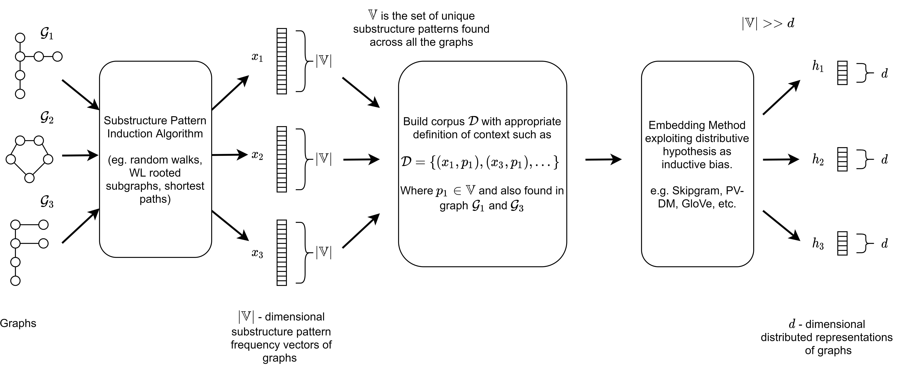

A quick primer on distributed representations of graphs
=======================================================

Here we provide a brief and simplified primer on learning distributed representations of graphs. This will not fully describe the various intricacies of existing methods, but cover a conceptual framework common to almost all distributed representations of graphs particularly for learning representations of substructure patterns and whole graphs. The above figure is a diagrammatic representation of this conceptual framework.

Given a set of graphs :math:`\mathbb{G} = \{ \mathcal{G}_1, \mathcal{G}_2, ... \mathcal{G}_n \}` one can induce discrete substructure patterns such as shortest paths, rooted subgraphs, graphlets, etc. using side-effects of algorithms such as the Floyd-Warshall or Weisfeiler-Lehman Graph Isomorphism test, and so on. This can be used to produce pattern frequency vectors :math:`\mathbf{X} = \{\mathbf{x}_1, \mathbf{x}_2, ..., \mathbf{x}_n \}` describing the occurrence frequency of substructure patterns over a shared vocabulary :math:`\mathbb{V}`. :math:`\mathbb{V}` is the set of unique substructure patterns induced across all of the graphs in the dataset :math:`\mathbb{G}`. 

Classically one may directly use these pattern frequency vectors within standard machine learning methods using vector inputs to perform some task. This is the approach taken by a variety of graph kernels. Unfortunately, as the graphs of :math:`\mathbb{G}` and subtructure patterns induced become more complex through size or specificity, the number of induced patterns increases dramatically. This, in turn, causes the pattern frequency vectors of :math:`\mathbf{X}` to be extremely sparse and high-dimensional. The high specificity of the patterns and the sparsity of the pattern frequency vectors cause a phenomenon known as diagonal dominance across the kernel matrices wherein each graph becomes more similar to itself and dissimilar from others, degrading the classification performance [1].

To address this issue it is possible to learn dense and low dimensional distributed representations of graphs that are inductively biased to be similar when they contain similar substructure patterns and dissimilar when they do not. To achieve this, the construction of a corpus dataset :math:`\mathcal{D}` is required detailing the target-context relationship between a graph and its induced substructure as in our example or a substructure pattern to other substructure patterns. In the simplest form for graph-level representation learning one can implement :math:`\mathcal{D}` as tuples of graphs and substructure pattern :math:`(\mathcal{G}_i, p_j) \in \mathcal{D}` if :math:`p_j \in \mathbb{V}` and :math:`p_j \in \mathcal{G}_i`. 

The corpus is utilised with a method that incorporates Harris' distributive hypothesis [2] to learn the distributed representations of graphs. skipgram, cbow, PV-DM, PV-DBOW [3, 4] are a few examples of neural embedding methods that incorporate this inductive bias and are all present in the Geo2DR library. In skipgram with negative sampling, as used in Graph2Vec [5], the distributed representations can be learned by optimizing

.. math::

   \mathcal{L} = \sum_{\mathcal{G}_i \in \mathbb{G}} \sum_{p \in \mathbb{V}} |\{{(\mathcal{G}_i, p ) \in \mathcal{D}}\}| (\log \sigma(\Phi_i \cdot \mathcal{S}_{p}) + k \cdot \mathbb{E}_{p_N \in P_D}[\log \sigma(-\Phi_i \cdot p_N)] 

over the corpus observations where :math:`\Phi \in \mathbb{R}^{|\mathbb{G}| \times d}` is the :math:`d` dimensional matrix of graph embeddings we desire of the graph dataset :math:`\mathbb{G}`, and :math:`\Phi_i` is embedding for :math:`\mathcal{G}_i \in \mathbb{G}`. Similarly, :math:`\mathcal{S} \in \mathbb{R}^{|\mathbb{V}| \times d}` are the :math:`d` dimensional embeddings of the substructure patterns in the vocabulary :math:`\mathbb{V}` so :math:`\mathcal{S}_p` represents the vector embedding corresponding to substructure pattern :math:`p`. The embeddings of the substructure patterns are also tuned but ultimately not used, as we are interested in the graph embeddings in :math:`\Phi`. :math:`k` is the number of negative samples with :math:`t_N` being the sampled context pattern, drawn according to the empirical unigram distribution :math:`P_D (p) = \frac{|\{p | \forall G_i \in \mathbb{G}, (G_i, p) \in \mathcal{D}\}|}{|D|}`.

The optimization of the above utility function creates the desired distributed representations of the targets in :math:`\Phi`, in this the case graph-level embeddings. These may be used as input for any downstream machine learning task and method that take vector inputs. The distributed representations benefit from having lower dimensionality than the pattern frequency vectors, in other words :math:`|\mathbb{V}| >> d`, being non-sparse, and being inductively biased via the distributive hypothesis in an unsupervised manner. For more in-depth reading we recommend [1-5].

1. Yanardag, P. and Vishwanathan, S. "Deep graph kernels." InProceedings of the 21th ACM SIGKDD InternationalConference on Knowledge Discovery and Data Mining,KDD’15, pp. 1365–1374, New York, NY, USA, 2015.ACM. ISBN 978-1-4503-3664-2. doi: 10.1145/2783258.2783417.
2. Harris,Z.S. "Distributional structure." WORD, 10(2-3):146–162, 1954. doi: 10.1080/00437956.1954.11659520
3. Mikolov, T., Chen, K., Corrado, G., and Dean, J. Efficientestimation of word representations in vector space. In1stInternational Conference on Learning Representations,ICLR 2013, Scottsdale, Arizona, USA, May 2-4, 2013, Workshop Track Proceedings, 2013.
4. Le, Q. and Mikolov, T. Distributed representations of sen-tences and documents.   InProceedings of the 31st In-ternational Conference on International Conference onMachine Learning - Volume 32, ICML’14, pp. II–1188–II–1196. JMLR.org, 2014
5. Narayanan, A., Chandramohan, M., Venkatesan, R., Chen,L., Liu, Y., and  Jaiswal, S. "graph2vec:Learning distributed representations of graphs." CoRR,abs/1707.05005, 2017.